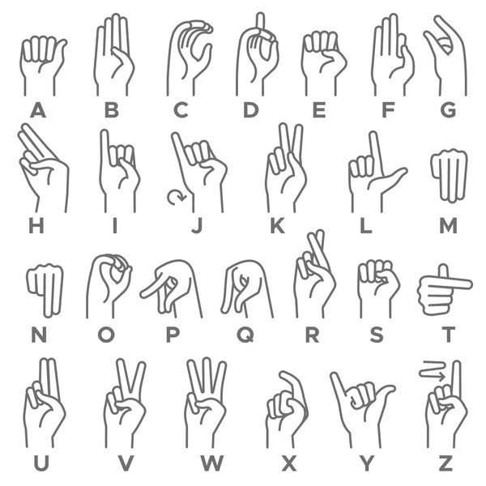

# Proyecto Final de Inteliencia Artificial

## Descripción del proyecto

De acuerdo con la aplicación web desarrollada como proyecto final, los aspectos que deberán de considerar son los siguientes:
- Utilización de las librerías de `TensorFlowJs`
- Utilización del alfabeto para sordos, más comúnmente utilizado es el `alfabeto manual americano (AML)` o `alfabeto dactilológico`. Este alfabeto utiliza las manos para representar cada una de las letras del alfabeto inglés. Cada letra se representa mediante una configuración específica de los dedos y la mano.
- Reconocimiento/Almacenamiento del alfabeto y/o palabras compuestas del alfabeto, con la finalidad de que la aplicación web pueda ir generando conocimiento. Diseño y creatividad de la aplicación web.

## Funcionamiento

Para el funcionamiento de la aplicación web se recomienda ejecutar a través de un servidor local, para ello se puede utilizar la extensión de Visual Studio Code llamada `Live Server`.

1. Esperar a que se cargue el modelo de `TensorFlowJs`.
2. Cargar o entrenar un modelo con el alfabeto de señas.
   1. Si se desea entrenar un modelo, se deberá presionar el botón `Entrenar` y realizar el reconocimiento de las letras del alfabeto de señas e indicar la letra que se está mostrando.
   2. Si se desea guardar un modelo, una vez entrenado un modelo se debe dar clic en el botón `Guardar`.
   3. Por el contrario, si se desea cargar un modelo, se debe dar clic en el botón `Cargar` y seleccionar el modelo que se desea cargar en formato `.json`.
3. Realizar el reconocimiento de las letras del alfabeto de señas.
4. Realizar el reconocimiento de palabras compuestas del alfabeto de señas.
5. La aplicación web irá prediciendo las letras y palabras compuestas del alfabeto de señas con un porcentaje de confianza.

## Alfabeto en lengua de señas

## Integrantes

- Daniela Trejo Cañas
- Axel Rubén Palacios García
- Gustavo Alonso Pascual Andrade